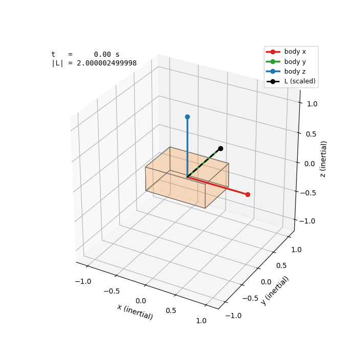
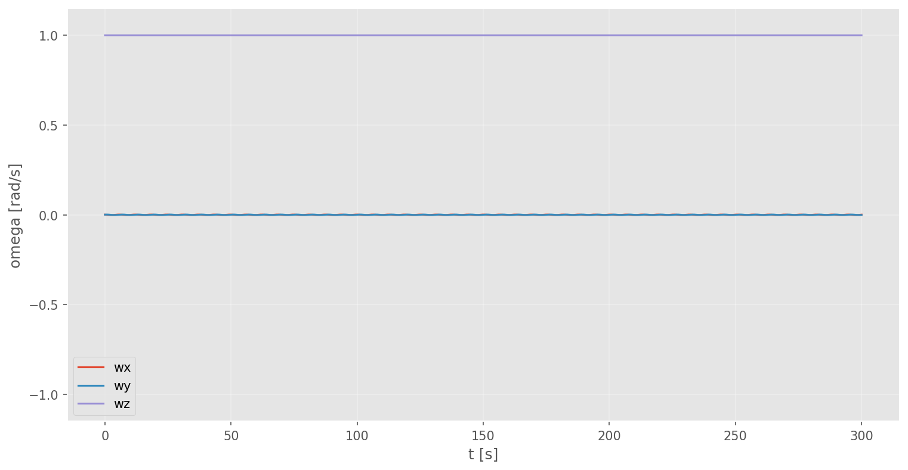
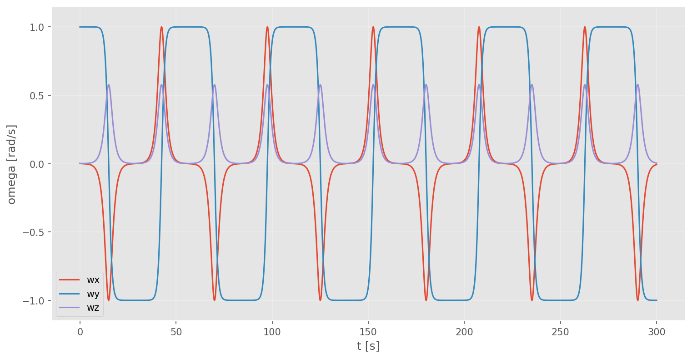
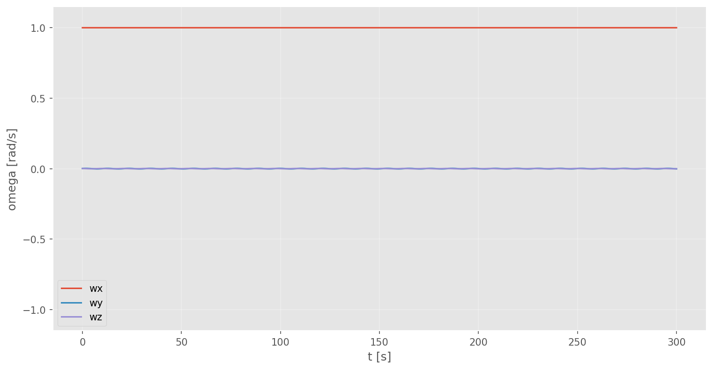

# adcs-sim

A CubeSat ADCS (Attitude Determination and Control System) simulator in C++ from scratch.

The goals of this project are:
 - Modelling the ADCS of **ELECTRA** (the main project of the [CubeSat Team PoliTO](https://www.cubesatpolito.com/projects)):
 simulate its tumbling in orbit, attitude determination from sensors, attitude control using magnetorquers and a flywheel. Hopefully my program can be used to aid its development too.
 - To learn about attitude determination and estimation, orbital physics, numerical methods and the interesting mathematics involved.
 - To practice and have fun!

Vector and quaternion maths were coded by me rather than using some library. This was done for practice.

---

## The Dzhanibekov effect



A rigid body spun about its **intermediate** principal axis (I_2) flips periodically end over end. It is an unstable equilibrium.

While if we give an initial spin about the major (I_3) or the minor (I_1) principal axis, the rotation remains stable. We can see this because perturbations in ω stay small.

| Major axis (stable) | Intermediate axis (unstable) | Minor axis (stable) |
|---|---|---|
|  |  |  |

All three cases were calculated with inertia tensor I = diag(1, 2, 3) and a tiny component of the initial ω in the other two directions (1e-3).

---

## Status

- [x] **Layer 0** — build system, test harness, universal plotter, 3D attitude animator, generic RK4
- [x] **Layer 1** — rigid body attitude dynamics (Euler's equations + quaternion kinematics)
- [ ] **Layer 2** — orbit propagation, dipole magnetic field, gravity gradient torque
- [ ] **Layer 3** — sensor models (magnetometer, sun sensor, gyro) and eclipse
- [ ] **Layer 4** — attitude determination: TRIAD, then a Multiplicative Extended Kalman Filter
- [ ] **Layer 5** — control: B-dot detumbling and quaternion-feedback pointing

---

## Build

**Requirements**

| | |
|---|---|
| C++ compiler | C++17 (developed with TDM-GCC 10.3.0) |
| CMake | ≥ 3.20, with Ninja |
| Python | 3.11+ with `numpy`, `pandas`, `matplotlib` (for the plots) |

Eigen 3.4.1 and Catch2 v3.5.2 are fetched automatically by CMake — no need to manually install.

```bash
cmake -S . -B build -G Ninja -DCMAKE_BUILD_TYPE=Debug
cmake --build build
```

**Run the tests**

```bash
cd build && ctest --output-on-failure
```

**Run a simulation**

`sim` takes a timestep and an output path, and writes an attitude log as a CSV.

```bash
mkdir data
./build/sim.exe 0.01 data/tumble.csv
```

Output columns: `t, qw, qx, qy, qz, wx, wy, wz`.

**Plotting**

```bash
# angular velocity components plotted against time
python scripts/plot.py data/tumble.csv -y wx wy wz --xlabel "t [s]" --ylabel "omega [rad/s]"

# 3D animation of the body tumbling, with the angular momentum vector drawn
python scripts/animate.py data/tumble.csv --inertia 1 2 3 --trail --save tumble.gif
```

Both scripts take `--help`. CSVs are put in `data/` (gitignored); saved plots go to `docs/plots/`.

---

## Verification

**Integrator.** RK4 on `ẋ = −x` against the closed-form `e^{−t}`. Halving the timestep reduces the error
by roughly 16×. This confirms the fourth-order convergence.

**Rotations.** Round-trip identities and 90° rotations about each axis compared to hand computed results.

**Conservation.** Torque-free tumble, `I = diag(1, 2, 3)`, `dt = 0.0125 s`, over 1000 seconds of
simulated time:

| Quantity | Stays constant to |
|---|---|
| Angular momentum `‖L‖` in the inertial frame | 1e-9 |
| Kinetic energy `½ ωᵀ I ω` | 1e-10 |
| Quaternion norm `‖q‖` | 1e-10 |

---

## Conventions

Decided beforehand.

- **Quaternions** scalar-first, `(w, x, y, z)`
- **Multiplication** Hamilton product
- **`q` rotates body → inertial**
- **Inertial frame** is ECI; its acceleration and precession are negligible over the timescales here
- `Vec3` and `Quaternion` are hand-written; everything else mathematical comes from Eigen

---

## Layout

```
include/adcs/   headers: vec3, quaternion, integrator, rigid_body
src/            holds main and the version
tests/          the Catch2 tests, separated by files
scripts/        plot.py (2D plots), animate.py (3D attitude animation)
docs/           Relevant plots
```

---

## Physics

Two equations, integrated together as a single state `{q, ω}`:

```
ω̇ = I⁻¹ (τ − ω × (I ω))      Euler's rotational equation
q̇ = ½ q ⊗ (0, ω)             quaternion kinematics
```

The first equation tells us how the angular velocity changes, while the second one tells us how the rotation quaternion changes with given angular velocity.
While q̇ should always be orthogonal to q (so q should stay unit length), numerical errors make q's norm drift off in the long term. That's why q is normalized after each iteration. 
(Although it has been tested that even without normalization it can work great: within 1e-10 of unit norm with dt = 0.0125)

---

## References

- 3Blue1Brown & Ben Eater — [visualising quaternions](https://eater.net/quaternions)
- Markley & Crassidis, Fundamentals of Spacecraft Attitude Determination and Control

---

## Assistance

I used Claude AI to give me feedback, explanations and to help me find errors.
I didn't use it to implement anything because this project has a learning and practice goal to it.
